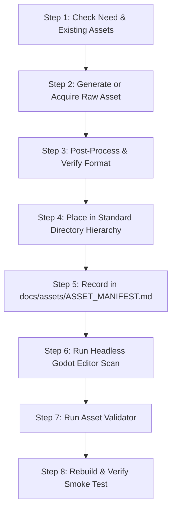

# AI-Assisted Asset Pipeline Specification

- **Date Established:** 2026-10-01
- **Status:** Active & Enforced
- **Primary Tool:** `scripts/validate_assets.gd` (and `tests/test_runner.gd` Group R)
- **Manifest File:** [`docs/assets/ASSET_MANIFEST.md`](file:///c:/Users/SAMI/Desktop/ProjectZero/OriginalRPG/docs/assets/ASSET_MANIFEST.md)

---

## 1. Overview & Core Principles

OriginalRPG uses an **AI-assisted, human-supervised, automated-validation** asset workflow. AI tools (e.g. generative models, diffusion pixel art pipelines, prompt-driven editors) may be used to create source artwork, but **no asset enters the runtime project without strict schema, dimension, transparency, and manifest compliance.**

### Core Rules
1. **Never mass-generate without manifest records**: Every asset must be documented in `docs/assets/ASSET_MANIFEST.md`.
2. **Never commit unvalidated assets**: Run `scripts/validate_assets.ps1` (or `godot --headless -s scripts/validate_assets.gd`) prior to any commit.
3. **Never overwrite existing working assets** without explicit instruction: Always preserve backward compatibility.
4. **Clean transparency is non-negotiable**: All raster textures must be 32-bit RGBA with transparent alpha channels. No white/black background fringes or solid chroma keys.
5. **Standardized coordinate perspective**: Standard world assets (characters, monsters, props, tiles) use a **low top-down (3/4 low isometric)** perspective.

---

## 2. Directory Hierarchy & Organization

All in-game visual assets live under `res://assets/`, categorized by domain:

```
assets/
├── characters/          # Playable character models & classes
│   └── <character_id>/  # e.g. player/, mage/
│       ├── idle/        # 8-direction idle animations
│       ├── walk/        # 8-direction walk cycles
│       ├── attack/      # Directional attack animations
│       └── <id>_sprite_frames.tres
├── monsters/            # Standard enemy mobs
│   └── <monster_family>/# e.g. goblin/, orc/, slime/
│       └── <monster_id>/# e.g. goblin_scout/
├── bosses/              # High-detail boss entities
│   └── <boss_id>/       # Multi-phase animations, large scale
├── npcs/                # Non-playable characters
│   ├── vendors/         # Shopkeepers
│   └── quest_givers/    # Townsfolk, mentors
├── maps/                # Full background illustrations / static arenas
├── tiles/               # Grid tilesets and terrain
│   ├── ground/          # Grass, dirt, stone, water
│   └── walls/           # Dungeon walls, cliffs, fences
├── ui/                  # User interface textures
│   ├── frames/          # 9-patch window frames, dialogue boxes
│   ├── bars/            # Health, mana, cast progress bars
│   └── buttons/         # Normal, hover, pressed states
├── icons/               # Square inventory & spell icons
│   ├── items/           # Consumables, equipment, quest items (32x32)
│   └── skills/          # Spellbook & action bar icons (32x32)
├── effects/             # Visual spell effects & combat particles
│   ├── spells/          # Fireball projectiles, heal auras
│   └── impacts/         # Slash hits, sparks, blood splatters
└── environment/         # World props, doodads, and obstacles
    ├── monuments/       # Ancient monuments, shrines
    ├── flora/           # Trees, shrubs, rocks
    └── structures/      # Ruins, pillars, portals
```

---

## 3. Naming Conventions

### File & Folder Names
- **Case:** Strict `snake_case` using lowercase alphanumeric characters, underscores, and hyphens (`[a-z0-9_\\-\\.]`).
- **Forbidden:** Uppercase letters, spaces, symbols (e.g. `@`, `#`, `!`, `%`), non-ASCII characters.

### Standard Asset ID Format
`<type>_<entity_or_item>_<variant_or_action>`
Examples:
- `char_player_idle_breathing`
- `monster_goblin_scout_idle`
- `boss_dragon_ancient_fly`
- `npc_blacksmith_idle`
- `env_ancient_monument_pillar`
- `tile_dungeon_stone_floor`
- `icon_item_potion_health`
- `icon_skill_fireball`
- `vfx_spell_fireball_projectile`

### Animation Frame Naming
- Multi-frame sequences in folders must use zero-padded frame numbers:
  `frame_000.png`, `frame_001.png`, `frame_002.png`, `frame_003.png`
- Directional sequences must use standard direction names:
  `south`, `south-east`, `east`, `north-east`, `north`, `north-west`, `west`, `south-west`

---

## 4. Technical Dimensions & Specifications

| Asset Category | Standard Dimensions (Width x Height) | Frame Count / Timing | Perspective | File Format |
|---|---|---|---|---|
| **Player Character** | 128x128 px | 4–8 frames per dir (5–8 FPS idle, 10–12 FPS walk) | Low top-down | PNG (RGBA8) |
| **Monsters (Small/Med)** | 64x64 px or 128x128 px | 4–6 frames per dir | Low top-down | PNG (RGBA8) |
| **Monsters (Large/Giant)** | 256x256 px | 4–8 frames per dir | Low top-down | PNG (RGBA8) |
| **Bosses** | 256x256 px or 512x512 px | Multi-frame phases | Low top-down | PNG (RGBA8) |
| **NPCs** | 128x128 px or 64x64 px | 2–4 frames idle | Low top-down | PNG (RGBA8) |
| **Icons (Items & Skills)** | Exactly 32x32 px (or 64x64 px HD) | 1 frame (Static) | Orthographic | PNG (RGBA8) |
| **Terrain Tiles** | Exactly 32x32 px grid | 1 frame / Autotile | Orthographic / 3/4 | PNG (RGBA8) |
| **Environment Props** | Divisible by 16px (e.g. 64x128, 128x256) | 1–4 frames | Low top-down | PNG (RGBA8) |
| **UI Windows / Panels** | Divisible by 2px (9-slice borders) | 1 frame | Flat 2D | PNG (RGBA8) / SVG |
| **Spell VFX / Impacts** | 64x64, 128x128, or 256x256 px | 6–12 frames | Top-down / Billowed | PNG (RGBA8) |

---

## 5. AI Prompting Recipes & Guidelines

When generating assets using generative models (e.g. Antigravity `generate_image`, Stable Diffusion, Midjourney, DALL-E):

### 5.1 General Style Keywords (Must Include)
> `classic 2D MMORPG style, detailed pixel art, crisp pixel clusters, carefully shaded pixels, strong clean silhouette, low top-down RPG perspective, transparent background, isolated subject, centered, no background, no text, no watermarks, full body, clean outlines`

### 5.2 Category-Specific Prompts

#### A. Character / Player
```
Prompt: "Fantasy [class/archetype] character, full body standing character, [direction: e.g. south 3/4 front view], wearing [equipment description], natural relaxed stance, classic 2D MMORPG aesthetic, crisp pixel art, clean outline, rich texture, warm natural earthy colors, transparent background, 128x128."
```

#### B. Monsters & Enemies
```
Prompt: "Fantasy [creature type, e.g. Goblin Scout / Orc Warrior], menacing combat posture, holding [weapon], classic 2D MMORPG monster sprite, low top-down perspective, crisp pixel art, vibrant [color] palette, distinct silhouette, transparent background, isolated, 128x128."
```

#### C. Icons (Items & Skills)
```
Prompt: "Isolated 2D RPG inventory icon of [item/spell, e.g. a potion flask filled with glowing crimson red liquid], bold silhouette, crisp pixel art, centered, no framing border, transparent background, 32x32 pixels."
```

#### D. Environment Props
```
Prompt: "Fantasy RPG world prop of [object, e.g. ancient weathered rune pillar with glowing cyan runes and mossy stone base], low top-down angle, classic RPG game art, crisp pixel art, transparent background, isolated object, 128x256."
```

### 5.3 Negative Prompts / Exclusions
Always exclude: `photorealistic, 3D render, blurry, messy edges, solid background, white background, shadow on floor (unless integrated in sprite), compression artifacts, text, border, signature, watermark`.

---

## 6. Step-by-Step Asset Integration Process for AI Agents

When an agent needs to add or update an asset:



1. **Check Existing Assets**: Inspect `res://assets/` and `docs/assets/ASSET_MANIFEST.md`. Do not duplicate or overwrite existing assets.
2. **Generate Asset**: Follow the prompting guide with exact dimension parameters (e.g. 32x32 for icons, 128x128 for characters).
3. **Post-Process**:
   - Ensure format is PNG with RGBA alpha channel.
   - Strip solid background color to 100% transparent.
   - Ensure image matches target grid dimensions.
4. **Place File**: Save in `res://assets/<category>/...` with strict `snake_case` naming.
5. **Update Manifest**: Append entry in `docs/assets/ASSET_MANIFEST.md` with complete metadata.
6. **Godot Editor Scan**: Run `godot --headless --editor --quit` so Godot generates `.import` metadata files.
7. **Run Asset Validator**: Run `scripts/validate_assets.ps1` (or `godot --headless -s scripts/validate_assets.gd`). All checks must pass.
8. **Run Test Runner & Build**: Run `tests/test_runner.gd` and execute `scripts/build.ps1`.

---

## 7. Automated Validation Checks

The asset validator (`AssetValidator` in `src/services/asset_validator.gd` and `scripts/validate_assets.gd`) automatically verifies:

1. **File Format**: Only `.png`, `.svg`, `.tres`, `.res`, and `.json` are permitted in `res://assets/`.
2. **Filename Conventions**: Rejects files with uppercase characters, spaces, or non-whitelisted characters.
3. **Dimensions**:
   - Icons must be square powers-of-two (32x32, 64x64, etc.).
   - Character and monster frames must be divisible by 16px grid units.
   - Tiles must be 16x16, 32x32, 48x48, or 64x64 px.
4. **Transparency**: PNG images must contain an alpha channel (RGBA8).
5. **Manifest Coverage**: All assets in `res://assets/` must be registered in `docs/assets/ASSET_MANIFEST.md`. Unmanifested files trigger validation failures.
